# PVC-Plus Resource Pack

A custom resource pack for Minecraft 1.21.5+ that applies custom textures to PVC-specific items based on their display names (NBT data).

## Custom Items Catalog

Below is a complete visual reference of the custom items, showing what vanilla item they replace and what their new texture looks like in-game!

| Custom Item                                             |                                                                                        Original Item                                                                                         |     |                                                    New Custom Texture                                                    |
| :------------------------------------------------------ | :------------------------------------------------------------------------------------------------------------------------------------------------------------------------------------------: | :-: | :----------------------------------------------------------------------------------------------------------------------: |
| **Caddozzo** _(Amethyst Shard)_                      |                 |  ➔  |                                        |
| **Nerchius Poop** _(Brown Dye)_                      |                             |  ➔  |              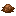              |
| **Very good cake** _(Cake)_                          |                                     |  ➔  |                         |
| **Very good bread** _(Bread)_                          |                                     |  ➔  |                         |
| **Nepero** _(Charcoal)_                              |                              |  ➔  |                                       |
| **Quarry Extractor Fuel** _(Charcoal)_               |                              |  ➔  |        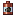         |
| **SKU Timepiece** _(Clock)_                          |                                |  ➔  |              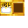               |
| **Chunk Protection Block** _(Copper Ore)_            |                        |  ➔  |             |
| **Mini Protection Block** _(Lapis Ore)_              |                          |  ➔  |               |
| **Nether Protection Block** _(Nether Gold Ore)_      |              |  ➔  |   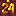    |
| **Standard Protection Block** _(Coal Ore)_           |                            |  ➔  |      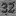      |
| **Large Protection Block** _(Redstone Ore)_          |                    |  ➔  |     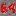      |
| **Mega Protection Block** _(Diamond Ore)_            |                      |  ➔  |      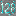       |
| **Super Protection Block** _(Deepslate Emerald Ore)_ |  |  ➔  | 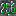 |
| **The Big Claim** _(Book)_                           |                                     |  ➔  |               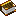               |
| **50 Votes Certificate** _(Diamond)_                 |                               |  ➔  |            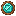            |
| **Squidward** _(Squid Spawn Egg)_                    |               |  ➔  |                            |
| **Totem of DLJ** _(Totem of Undying)_                |             |  ➔  |                                |
| **Totem of Orwell** _(Totem of Undying)_             |             |  ➔  |             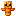             |
| **Playtime Certificate** _(Book)_                    |                                     |  ➔  |                       |
| **T2 Playtime Cert.** _(Book)_                       |                                     |  ➔  |                 |
| **Inactivity Certificate** _(Book)_                  |                                     |  ➔  |                      |
| **Inactivity Ticket** _(Paper)_                      |                                   |  ➔  |        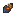         |
| **Bank O' Note** _(Paper)_                           |                                   |  ➔  |                                 |
| **$Llama Coin** _(Heart of the Sea)_                 |             |  ➔  |                 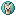                  |
| **BB Coin** _(End Crystal)_                          |                        |  ➔  |                                   |

---

_Note: Any images or textures referenced are pulled relatively from the standard resource pack architecture. If changes are made to the items, the images will automatically update on this preview if they share the same filename!_

## Installation

1. Download the compiled zip folder (usually excluded from `README.md`).
2. Place the zip file in your Minecraft `resourcepacks` folder.
3. Enable the resource pack in Minecraft settings.

## Technical Structure

The pack follows a strict separation between vanilla logic overrides and custom assets designed to support complex custom model mapping:

- **`assets/minecraft/items/*.json`**: Vanilla Item Model Logic that hijacks the original item and checks the name.
- **`assets/pvc-plus/models/item/*.json`**: Custom Item Models that are used by the Vanilla Item Model Logic, usually named for their in-game name.
- **`assets/pvc-plus/textures/item/`**: Project-specific visual texture assets, usually named for what they look like.
